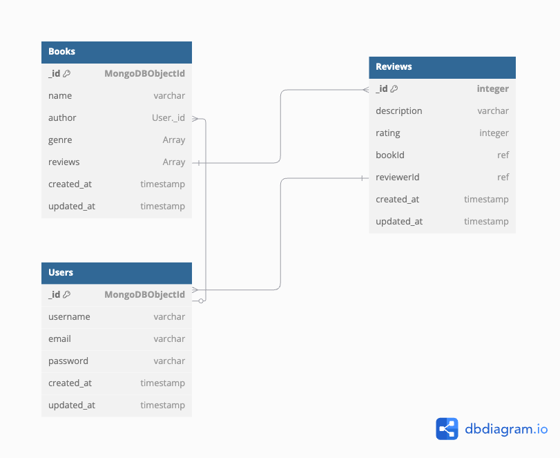

Schema : Refer added File in root : 'Schema-BooksAPI.png'

Postman Collection - Refer added file in root : 'BookAPI.postman_collection.json'
<a href="./BookAPI.postman_collection.json">Postman Collection</a>

---API Endpoints---

User Router : 

Register
Route - POST - '/user/auth/signup' 
Payload : {
    "username": varchar,
    "email": varchar,
    "password": varchar
}

Login : 
Route - POST - '/user/auth/login'
Payload : {
    "email": varchar,
    "password": varchar
}
Response : {
    userDetails,
    Token : JWT (Needs to be added in header for auth routes),
}

--

Book Router :

Get Books (List)
Route - GET - '/books/'
Params : 
    Page : Integer (optional | default : 1)
    Limit: Integer (optional | default : 5)

Post a Book : Auth
Route - POST - '/books/'
Headers : {
    Authorization: "Baerer JWT_TOKEN_RECEIVED_FROM_LOGIN_RESPONSE"
}
Payload : {
    "name": varchar,
    "genre": [string]
}
response : {
    "name": varchar,
    "author": "User._id",
    "genre": [
        varchar,
    ],
    "reviews": [Review._id],
    "_id": "MongoDBObjectId",
    "createdAt": "timestamp",
    "updatedAt": "timestamp",
    "__v": 0
}

Get a Book (By Id)
Route - GET - /books/:ID
Params : 
    page : (optional | default 1 | pagination for reviewes) 
    limit: (optional | default 5 | limit for reviews count)
response: {
    "book" : BookData | Object,
    "rating" : "Average Rating | Integer",
    "reviews" : "review list | paginated"
}

Post a review to a book (Auth, once user can review a book only once)
Route - POST - '/books/:BookId/reviews'
Headers : {
    Authorization: "Baerer JWT_TOKEN_RECEIVED_FROM_LOGIN_RESPONSE"
}
Payload : {
    "description": varchar,
    "rating": Integer
}
response: {
    review: ReviewData
}

Update Review (Auth)
Route - PUT - '/reviews/:ReviewId'
Headers : {
    Authorization: "Baerer JWT_TOKEN_RECEIVED_FROM_LOGIN_RESPONSE"
}
Payload: {
    "description": varchar,
    "rating": Integer
}

Delete Review (Auth)
Route - DELETE - '/reviewes/:ReviewId'
Headers : {
    Authorization: "Baerer JWT_TOKEN_RECEIVED_FROM_LOGIN_RESPONSE"
}

---search---
Route - '/search/?query=Title_OR_Author'
query - if empty then redirects to - GET '/books'
response: {
    [Books]
}